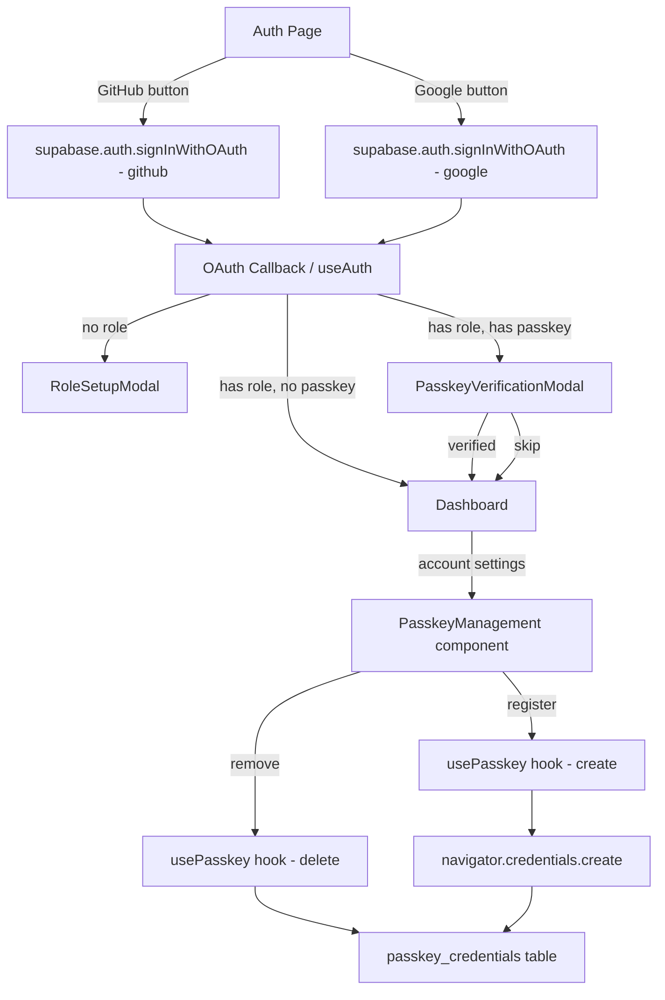
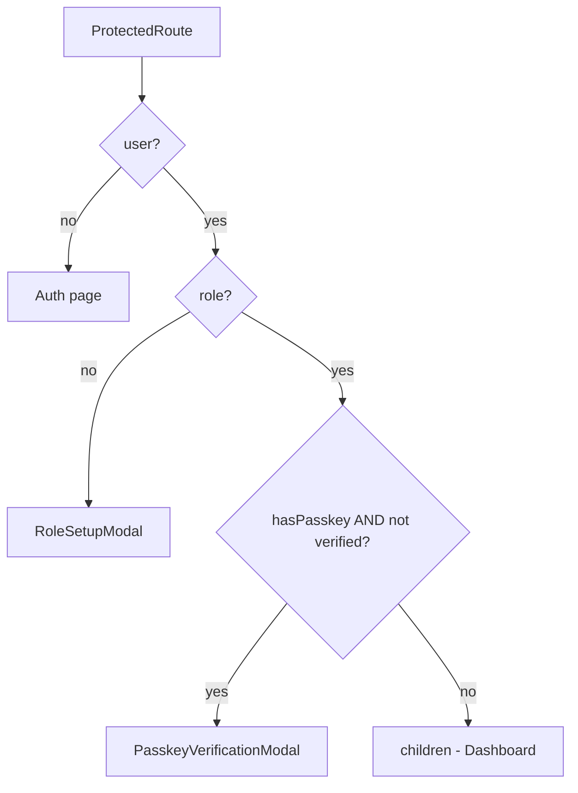

 # Design Document: OAuth + Passkey Authentication

## Overview

This feature extends the Academic Suite's existing authentication system with two additions:

1. **GitHub OAuth** — a second federated login provider alongside Google, using the same `supabase.auth.signInWithOAuth` pattern already in place.
2. **WebAuthn/Passkey** — a device-bound second factor that prompts users for biometric or PIN verification after OAuth login, using the browser's native `navigator.credentials` API.

The design is intentionally additive: existing Google OAuth and email/password flows are unchanged. New code is layered on top via new hooks, a new service module, and a new database table.

---

## Architecture



The flow is linear: OAuth → role check → passkey check → dashboard. Each step is a separate React component/modal, keeping concerns isolated.

---

## Components and Interfaces

### New Files

| Path | Purpose |
|------|---------|
| `src/services/passkeyService.ts` | Pure functions wrapping `navigator.credentials.create/get` and DB operations |
| `src/hooks/usePasskey.ts` | React hook exposing passkey state and actions to components |
| `src/components/PasskeyVerificationModal.tsx` | Modal shown after OAuth login when a passkey is registered |
| `src/components/PasskeyRegistrationPrompt.tsx` | Inline prompt offering passkey registration post-login |
| `src/components/PasskeyManagement.tsx` | Account settings section listing and removing passkeys |

### Modified Files

| Path | Change |
|------|--------|
| `src/pages/Auth.tsx` | Add GitHub OAuth button; wire passkey registration prompt |
| `src/App.tsx` | Add passkey verification step in `ProtectedRoute` after role check |
| `src/hooks/useAuth.tsx` | Expose `hasPasskey` flag derived from DB query |
| `insforge-schema.sql` | Add `passkey_credentials` table |

### Key Interfaces

```typescript
// passkeyService.ts
interface PasskeyCredential {
  id: string;                  // UUID primary key
  user_id: string;
  credential_id: string;       // base64url-encoded WebAuthn credential ID
  public_key: string;          // base64url-encoded COSE public key
  device_hint: string;         // e.g. "Chrome on MacBook"
  created_at: string;
}

interface RegisterPasskeyResult {
  success: boolean;
  credentialId?: string;
  error?: string;
}

interface VerifyPasskeyResult {
  success: boolean;
  error?: string;
}

// usePasskey.ts
interface UsePasskeyReturn {
  isSupported: boolean;        // window.PublicKeyCredential exists
  credentials: PasskeyCredential[];
  loading: boolean;
  register: () => Promise<RegisterPasskeyResult>;
  verify: (credentialIds: string[]) => Promise<VerifyPasskeyResult>;
  remove: (credentialId: string) => Promise<void>;
}
```

### GitHub OAuth Button

Added to `Auth.tsx` alongside the existing Google button:

```typescript
const handleGitHubLogin = async () => {
  localStorage.setItem("pending_role", signupRole);
  const { error } = await supabase.auth.signInWithOAuth({
    provider: "github",
    options: { redirectTo: window.location.origin },
  });
  if (error) toast.error(error.message);
};
```

### ProtectedRoute Flow (App.tsx)



A `passkeyVerified` boolean is stored in React state (not persisted) so the modal only shows once per session.

---

## Data Models

### New Table: `passkey_credentials`

```sql
CREATE TABLE IF NOT EXISTS passkey_credentials (
  id              UUID DEFAULT gen_random_uuid() PRIMARY KEY,
  user_id         UUID REFERENCES auth.users(id) ON DELETE CASCADE NOT NULL,
  credential_id   TEXT NOT NULL UNIQUE,   -- base64url WebAuthn credential ID
  public_key      TEXT NOT NULL,          -- base64url COSE public key
  device_hint     TEXT NOT NULL DEFAULT '',
  created_at      TIMESTAMPTZ DEFAULT now() NOT NULL
);

ALTER TABLE passkey_credentials ENABLE ROW LEVEL SECURITY;

CREATE POLICY "Users manage own passkeys" ON passkey_credentials
  FOR ALL USING (auth.uid() = user_id);
```

### WebAuthn Options

**Registration (`navigator.credentials.create`)**:
```typescript
const options: PublicKeyCredentialCreationOptions = {
  rp: { name: "Academic Suite", id: window.location.hostname },
  user: {
    id: Uint8Array.from(userId, c => c.charCodeAt(0)),
    name: userEmail,
    displayName: userEmail,
  },
  challenge: crypto.getRandomValues(new Uint8Array(32)),
  pubKeyCredParams: [
    { type: "public-key", alg: -7 },   // ES256
    { type: "public-key", alg: -257 }, // RS256
  ],
  authenticatorSelection: {
    userVerification: "required",
    residentKey: "preferred",
  },
  timeout: 60000,
};
```

**Verification (`navigator.credentials.get`)**:
```typescript
const options: PublicKeyCredentialRequestOptions = {
  challenge: crypto.getRandomValues(new Uint8Array(32)),
  rpId: window.location.hostname,
  allowCredentials: credentialIds.map(id => ({
    type: "public-key",
    id: base64urlDecode(id),
  })),
  userVerification: "required",
  timeout: 60000,
};
```

> Note: Full cryptographic signature verification requires a server-side component. In this client-side implementation, successful completion of `navigator.credentials.get()` without error is treated as verification (the browser/OS handles biometric validation). For production hardening, a server-side verification step via an Edge Function can be added later.

### localStorage

| Key | Value | Lifecycle |
|-----|-------|-----------|
| `pending_role` | `"student"` or `"teacher"` | Set before OAuth redirect, consumed in `useAuth` after callback |

---

## Correctness Properties

*A property is a characteristic or behavior that should hold true across all valid executions of a system — essentially, a formal statement about what the system should do. Properties serve as the bridge between human-readable specifications and machine-verifiable correctness guarantees.*


### Property 1: Registration options invariant

*For any* authenticated user initiating passkey registration, `navigator.credentials.create()` must be called with options that include `rp.id` equal to `window.location.hostname`, a non-empty `challenge`, and at least one entry in `pubKeyCredParams`.

**Validates: Requirements 2.2, 2.6**

### Property 2: Registration storage round-trip

*For any* successful passkey registration, the record inserted into `passkey_credentials` must contain the `credential_id`, `public_key`, and `device_hint` fields derived from the credential returned by `navigator.credentials.create()`.

**Validates: Requirements 2.3, 4.1**

### Property 3: Verification uses stored credential IDs

*For any* user with one or more registered passkeys, `navigator.credentials.get()` must be called with `allowCredentials` containing exactly the credential IDs stored for that user in the database.

**Validates: Requirements 3.3**

### Property 4: Passkey list renders required fields

*For any* list of passkey credentials returned from the database, the rendered PasskeyManagement component must display the `device_hint` and formatted `created_at` for each credential.

**Validates: Requirements 4.2**

### Property 5: Remove credential deletes from DB

*For any* passkey credential belonging to a user, calling `remove(credentialId)` must result in a database delete operation targeting that exact `credential_id`, and the credential must no longer appear in the credentials list.

**Validates: Requirements 4.3**

### Property 6: pending_role localStorage round-trip

*For any* OAuth login flow where a role is selected before redirect, the `pending_role` key must be present in `localStorage` immediately after the OAuth call and must be absent (consumed) after `useAuth` processes the returning session.

**Validates: Requirements 5.5**

### Property 7: Unhandled passkey exceptions are caught

*For any* passkey operation (`create` or `get`) that throws an unexpected exception, the error must be caught, logged to the console, and the application must remain functional without crashing or leaving the user in a broken state.

**Validates: Requirements 6.3**

### Property 8: WebAuthn unavailability hides all passkey UI

*For any* render of the Auth page or account settings where `window.PublicKeyCredential` is `undefined`, no passkey-related UI elements (registration prompt, verification modal, management section) must be present in the DOM.

**Validates: Requirements 2.5, 6.1, 6.2**

---

## Error Handling

| Scenario | Handling |
|----------|---------|
| GitHub OAuth `signInWithOAuth` returns error | `toast.error(error.message)`, remove `pending_role` from localStorage |
| `navigator.credentials.create` throws `NotAllowedError` (user cancelled) | Silently dismiss registration prompt, no toast |
| `navigator.credentials.create` throws other error | `console.error`, toast "Passkey registration failed", allow user to continue |
| `navigator.credentials.get` throws `NotAllowedError` (user cancelled/timeout) | Show retry and skip options in PasskeyVerificationModal |
| `navigator.credentials.get` throws other error | `console.error`, show error message, offer skip |
| DB insert for passkey fails | `toast.error`, credential not stored, user can retry or skip |
| DB delete for passkey fails | `toast.error`, credential remains in list |
| Role upsert fails | `toast.error("Could not save role. Please try again.")`, modal stays open |
| `window.PublicKeyCredential` undefined | All passkey UI hidden; auth proceeds normally |

All passkey operations are wrapped in try/catch. Errors never propagate to crash the app.

---

## Testing Strategy

### Dual Approach

Both unit tests and property-based tests are required. They are complementary:
- Unit tests catch concrete bugs in specific scenarios and edge cases.
- Property tests verify universal correctness across many generated inputs.

### Unit Tests (Vitest + @testing-library/react)

Focus areas:
- Auth page renders GitHub button
- GitHub OAuth handler calls `signInWithOAuth` with `provider: "github"` and correct `redirectTo`
- GitHub OAuth error shows toast
- `ProtectedRoute` renders `PasskeyVerificationModal` when user has passkeys and session is unverified
- `ProtectedRoute` skips verification when credentials list is empty
- `PasskeyVerificationModal` shows retry/skip on `navigator.credentials.get` failure
- `PasskeyManagement` renders device hint and date for each credential
- `PasskeyRegistrationPrompt` is absent when `window.PublicKeyCredential` is undefined
- `RoleSetupModal` renders for OAuth user with no role (Google or GitHub)
- Role upsert failure shows error toast

### Property-Based Tests (fast-check + Vitest)

Library: `fast-check` (already compatible with Vitest, no extra runner needed).

Each property test runs a minimum of 100 iterations.

Tag format in test comments: `Feature: oauth-passkey-auth, Property {N}: {property_text}`

| Property | Test Description | Arbitraries |
|----------|-----------------|-------------|
| P1: Registration options invariant | Generate random user IDs and emails; mock `navigator.credentials.create`; assert options shape | `fc.uuid()`, `fc.emailAddress()` |
| P2: Registration storage round-trip | Generate random credential responses; assert DB insert receives matching fields | `fc.string()`, `fc.base64String()` |
| P3: Verification uses stored credential IDs | Generate random arrays of credential IDs; assert `allowCredentials` matches | `fc.array(fc.string())` |
| P4: Passkey list renders required fields | Generate random credential arrays; render component; assert each item shows hint and date | `fc.array(fc.record({...}))` |
| P5: Remove credential deletes from DB | Generate random credential IDs; call remove; assert delete called with correct ID | `fc.uuid()` |
| P6: pending_role round-trip | Generate random role values; simulate OAuth flow; assert localStorage key absent after callback | `fc.constantFrom("student", "teacher")` |
| P7: Unhandled exceptions caught | Generate random Error objects thrown by credentials API; assert no unhandled rejection | `fc.string()` for error messages |
| P8: WebAuthn unavailability hides UI | Render with `window.PublicKeyCredential = undefined`; assert no passkey elements in DOM | (no arbitrary needed — deterministic) |

Each property-based test must be a single `test()` block using `fc.assert(fc.property(...))` and must include the tag comment referencing the design property number.
